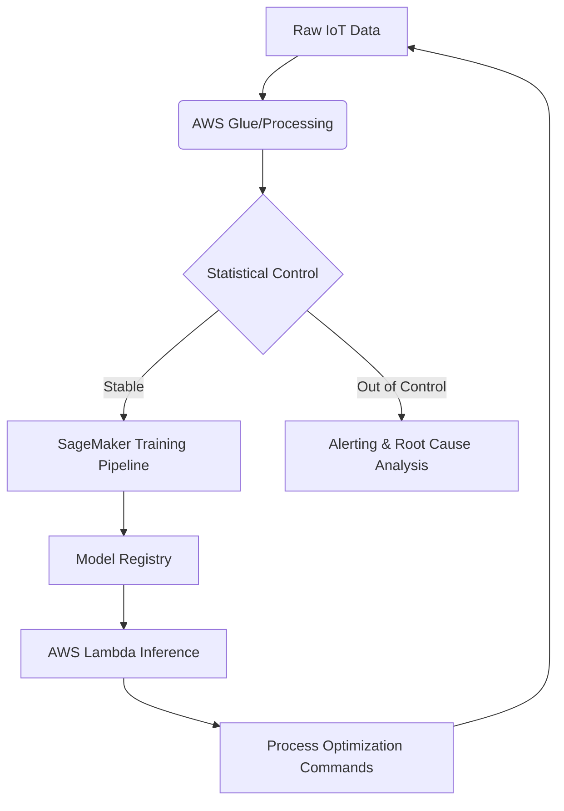

# Statistical MLOps AWS Suite

An enterprise-grade framework for **Statistical Process Control (SPC)** and **Six Sigma** integration within cloud-native Machine Learning workflows. This repository bridges the gap between traditional manufacturing quality control and advanced AI-driven process optimization.

## 🏗️ Architecture Overview

The system orchestrates a closed-loop MLOps lifecycle on AWS, utilizing SageMaker for training and Lambda for serverless inference, underpinned by rigorous statistical validation.



## 🚀 Core Features

### 1. Statistical Process Control (SPC)
- **Control Charts:** Automatic generation of X-bar and R-charts to monitor process stability.
- **Anomaly Detection:** Identification of special-cause variation based on Six Sigma (3rd standard deviation) and Western Electric rules.
- **Process Capability:** Automated calculation of Cp and Cpk indices to measure process performance against specification limits.

### 2. AWS SageMaker Orchestration
- **Modular Pipelines:** Integration with SageMaker Pipelines for repeatable, audited model development.
- **Pre-training Validation:** Built-in statistical checks to ensure training data represents a "stable" process state.
- **Experiment Tracking:** Comprehensive logging of hyperparameters and process metrics.

### 3. Serverless Inference
- **Inference Handler:** Optimized AWS Lambda stub for low-latency, real-time predictions.
- **Cold-Start Optimization:** Strategy for caching model artifacts from S3.

## 📁 Repository Structure

```text
Statistical-MLOps-AWS-Suite/
├── deployment/
│   └── aws-lambda-handler.py     # Serverless inference logic
├── src/
│   ├── analytics/
│   │   └── statistical_control.py # SPC and Six Sigma logic
│   ├── ml/
│   │   └── model_trainer.py       # Scikit-learn/XGBoost training script
│   └── aws/
│       └── sagemaker_pipeline.py  # SageMaker Pipeline orchestration
├── tests/
│   └── test_statistics.py        # Pytest suite for SPC logic
├── requirements.txt              # Production dependencies
└── README.md                     # Documentation
```

## 🛠️ Getting Started

### Prerequisites
- Python 3.9+
- AWS CLI configured with appropriate permissions.
- Access to AWS SageMaker and Lambda.

### Installation
```bash
git clone https://github.com/fidif/Statistical-MLOps-AWS-Suite.git
cd Statistical-MLOps-AWS-Suite
pip install -r requirements.txt
```

### Running Tests
```bash
pytest tests/
```

## 🎓 Philosophical Background: Manufacturing Meets AI

Traditional Six Sigma methodologies focus on reducing process variation to achieve 3.4 defects per million opportunities. This framework treats Machine Learning as a **Digital Control Loop**. By applying SPC to both the input data (features) and the model predictions, we ensure that AI remains a stable and reliable component of the industrial process.

---
**Author:** Senior Data Science Specialist
**License:** Enterprise Proprietary
